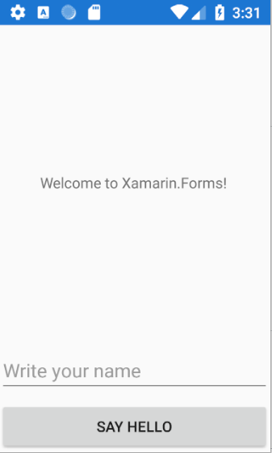
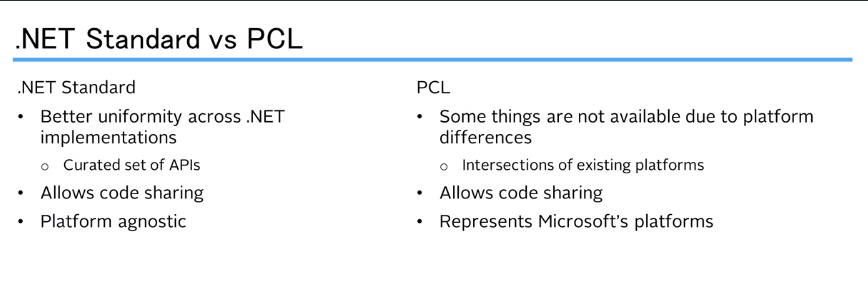
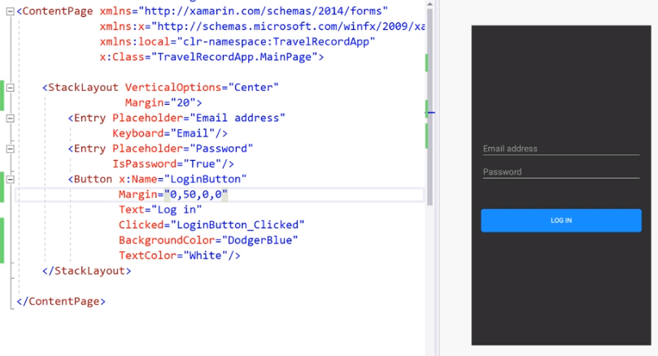
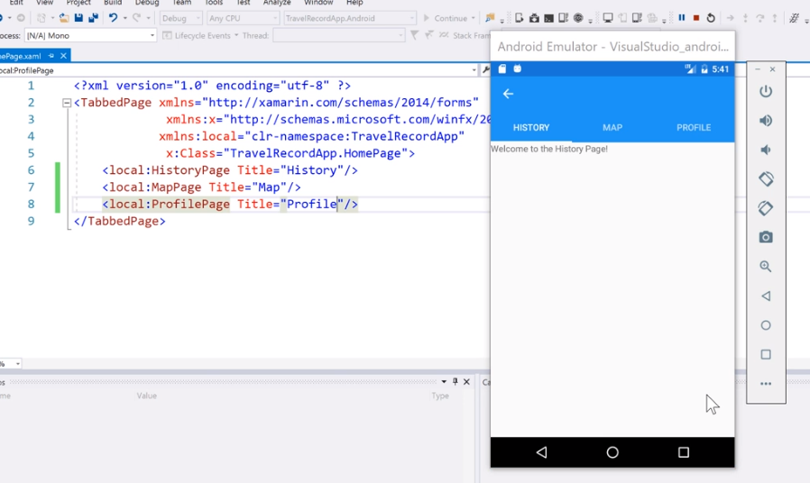
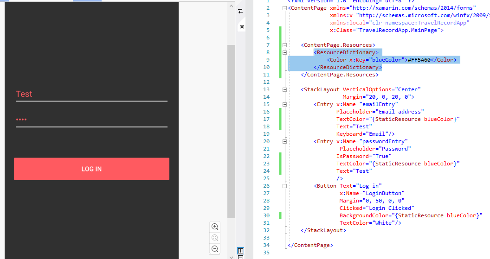
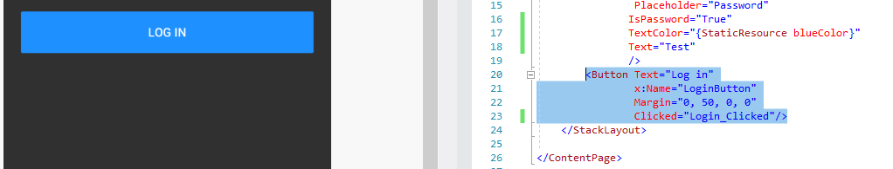
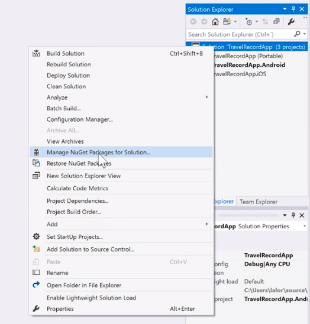
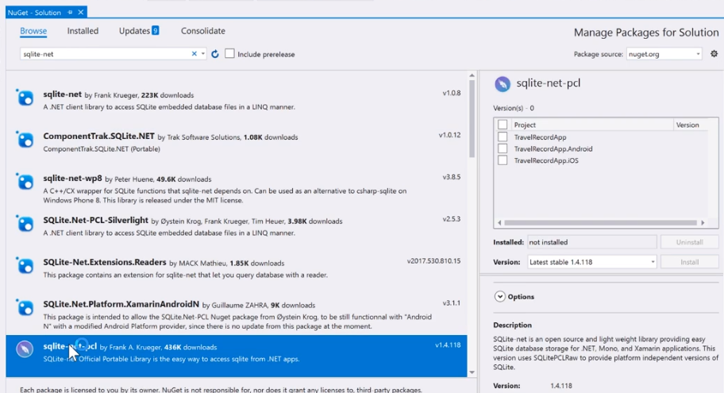
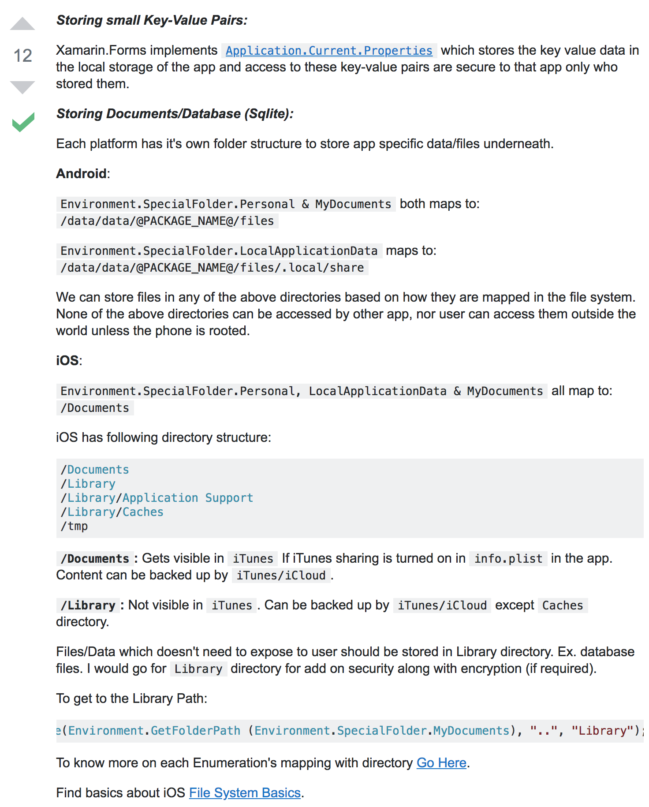

## 16

```cs
<?xml version="1.0" encoding="utf-8" ?>
<ContentPage xmlns="http://xamarin.com/schemas/2014/forms"
             xmlns:x="http://schemas.microsoft.com/winfx/2009/xaml"
             xmlns:local="clr-namespace:HelloWorld"
             x:Class="HelloWorld.MainPage">

    <StackLayout>
        <Label Text="Welcome to Xamarin.Forms!"
           HorizontalOptions="Center"
           VerticalOptions="CenterAndExpand" />
        <Entry Placeholder="Write your name" />
        <Button Text="Say Hello"
                Clicked="Button_Clicked"/>
    </StackLayout>

</ContentPage>
```



여기서 이제 입력을 받아서 Label 에 표시를 하려고 할경우,
각 프로퍼티에는 Name 이 지정되어야만 한다.

```xml
<?xml version="1.0" encoding="utf-8" ?>
<ContentPage xmlns="http://xamarin.com/schemas/2014/forms"
             xmlns:x="http://schemas.microsoft.com/winfx/2009/xaml"
             xmlns:local="clr-namespace:HelloWorld"
             x:Class="HelloWorld.MainPage">

    <StackLayout>
        <Label x:Name="greetingLabel"
               Text="Welcome to Xamarin.Forms!"
               HorizontalOptions="Center"
               VerticalOptions="CenterAndExpand" />
        <Entry x:Name="nameEntry"
               Placeholder="Write your name" />
        <Button Text="Say Hello"
                Clicked="Button_Clicked"/>
    </StackLayout>

</ContentPage>
```

```cs
using System;
using Xamarin.Forms;

namespace HelloWorld
{
    public partial class MainPage : ContentPage
    {
        public MainPage()
        {
            InitializeComponent();
        }

        private void Button_Clicked(object sender, EventArgs e)
        {
            greetingLabel.Text = "Welcome "  + nameEntry.Text;
        }
    }
}
```

# Section 4

## The New .NET Standard

- Specification of .NET APIs intended to work on all .NET implementations
  



## NavigationPage

https://qiita.com/amay077/items/b5f1124a78afbd48f19b

Xamarin.Forms で NavigationPage を使うと、 iOS では ナビゲーションバー(UINavigationBar)、Android では Action Bar がそれぞれ使用されます。

- HomePage

  ```xml
  <?xml version="1.0" encoding="utf-8" ?>
  <ContentPage xmlns="http://xamarin.com/schemas/2014/forms"
              xmlns:x="http://schemas.microsoft.com/winfx/2009/xaml"
              x:Class="TravelRecordApp.HomePage">

      <StackLayout VerticalOptions="Center">
          <Label>
              asdf
          </Label>

      </StackLayout>
  </ContentPage>
  ```

- App

  ```cs
  public App()
      {
          InitializeComponent();

          MainPage = new NavigationPage(new MainPage());
      }
  ```

- MainPage

  ```cs
  using System;
  using Xamarin.Forms;

  namespace TravelRecordApp
  {
      public partial class MainPage : ContentPage
      {
          public MainPage()
          {
              InitializeComponent();
          }

          private void Login_Clicked(object sender, EventArgs e)
          {
              bool isEmailEmpty = string.IsNullOrEmpty(emailEntry.Text);
              bool isPasswordEmpty = string.IsNullOrEmpty(passwordEntry.Text);

              if(isEmailEmpty || isPasswordEmpty)
              {

              }
              else
              {
                  Navigation.PushAsync(new HomePage());
              }

          }
      }
  }
  ```

## Tabbed Page

- HomePage

  ```cs
  namespace TravelRecordApp
  {
      [XamlCompilation(XamlCompilationOptions.Compile)]
      public partial class HomePage : TabbedPage
      {
          public HomePage ()
          {
              InitializeComponent ();
          }
      }
  }
  ```

        - HomePage : TabbedPage 로 변경

  ```xml
  <?xml version="1.0" encoding="utf-8" ?>
  <TabbedPage xmlns="http://xamarin.com/schemas/2014/forms"
              xmlns:x="http://schemas.microsoft.com/winfx/2009/xaml"
              xmlns:local="clr-namespace:TravelRecordApp"
              x:Class="TravelRecordApp.HomePage">

      <local:HistoryPage Title="History"/>
      <local:MapPage Title="Map"/>
      <local:ProfilePage Title="Profile"/>
  </TabbedPage>
  ```

        - Title 지정해서 이름이 뜨도록 하자.

  -



## XAML Resources



```xml
<Application xmlns="http://xamarin.com/schemas/2014/forms"
             xmlns:x="http://schemas.microsoft.com/winfx/2009/xaml"
             x:Class="TravelRecordApp.App">
    <Application.Resources>
        <ResourceDictionary>
            <Color x:Key="blueColor">#1E90FF</Color>
        </ResourceDictionary>

    </Application.Resources>
</Application>
```

- 전체에 적용시키기 위해서 Application 의 최 상단위 xml 파일에 `ResourceDictionary`를 생성

```xml
<Entry x:Name="emailEntry"
    Placeholder="Email address"
    TextColor="{StaticResource blueColor}"
    Text="Test"
    Keyboard="Email"/>
```

- 지정한 Dictionary 의 적용은 React 에서 View 에 js 쓸때랑 비슷하게 { ~ } 에 적어주는데 {StaticResource ~}로 시작하는 것만 다름

## Implicit XAML Styles

```xml
<?xml version="1.0" encoding="utf-8" ?>
<Application xmlns="http://xamarin.com/schemas/2014/forms"
             xmlns:x="http://schemas.microsoft.com/winfx/2009/xaml"
             x:Class="TravelRecordApp.App">
    <Application.Resources>
        <ResourceDictionary>
            <Color x:Key="blueColor">#1E90FF</Color>
            <Color x:Key="whiteColor">#FFFFFF</Color>

            <Style TargetType="Button">
                <Setter Property="BackgroundColor" Value="{StaticResource blueColor}"/>
                <Setter Property="TextColor" Value="{StaticResource whiteColor}"/>
            </Style>
        </ResourceDictionary>

    </Application.Resources>
</Application>
```



- 밑의 hierarchy 에 Style 을 지정하고 싶다면 위처럼 ResourceDictionary > Style.TargetType="~~" 으로 적고 `Setter`로 적용 property 를 지정하면 된다.
- 만약 하위 hierachy 에서 바꾸고 싶다면 overriding 하면 된다.

## Explicit XAML Styles

```xml
// App.xaml
<Style x:Key="normalButton" TargetType="Button">
    <Setter Property="BackgroundColor" Value="{StaticResource blueColor}"/>
    <Setter Property="TextColor" Value="{StaticResource whiteColor}"/>
</Style>
```

```xml
<Button Text="Log in"
    x:Name="LoginButton"
    Margin="0, 50, 0, 0"
    Clicked="Login_Clicked"
    Style="{StaticResource normalButton}"/>
```

- `<Style>`에 `x:Key`를 통해 키이름을 지정하면, 적용하고싶은 곳에 `<Style>`을 통해 정확하게 지정을 해주지 않는이상 스타일이 적용되지 않는다.

# SQLite - Local Databases




## Database Constructor

```cs
// App.cs
using System;
using Xamarin.Forms;
using Xamarin.Forms.Xaml;

[assembly: XamlCompilation(XamlCompilationOptions.Compile)]
namespace TravelRecordApp
{
    public partial class App : Application
    {

        public static string DatabaseLocation = string.Empty;
        public App()
        {
            InitializeComponent();

            MainPage = new NavigationPage(new MainPage());
        }

        public App(string databaseLocation)
        {
            InitializeComponent();

            MainPage = new NavigationPage(new MainPage());

            DatabaseLocation = databaseLocation;
        }
        //...
    }
}
```

## Database Path



- Android

  ```cs
  // MainActivity.cs
  namespace TravelRecordApp.Droid
  {
      public class MainActivity
      {
          protected override void OnCreate(Bundle savedInstanceState)
          {
              TabLayoutResource = Resource.Layout.Tabbar;
              ToolbarResource = Resource.Layout.Toolbar;

              base.OnCreate(savedInstanceState);
              global::Xamarin.Forms.Forms.Init(this, savedInstanceState);

              // add db
              string dbName = "travel_db.sqlite";
              string folderPath = System.Environment.GetFolderPath(System.Environment.SpecialFolder.Personal);
              string fullPath = Path.Combine(folderPath, dbName);

              LoadApplication(new App());
          }
      }
  }
  ```

- iOS

  ```cs
  // AppDelegate.cs
  namespace TravelRecordApp.iOS
  {
      public partial class AppDelegate
      {
          public override bool FinishedLaunching(UIApplication app, NSDictionary options)
          {
              global::Xamarin.Forms.Forms.Init();

              // add db
              string dbName = "travel_db.sqlite";
              // NOTE :: Different with Android's path
              string folderPath = Path.Combine(
                  System.Environment.GetFolderPath(System.Environment.SpecialFolder.Personal), "..", "Library");
              string fullPath = Path.Combine(folderPath, dbName);

              LoadApplication(new App());

              return base.FinishedLaunching(app, options);
          }
      }
  }
  ```
