## Error
- Maximum Path Length Limitation In the fk Windows
  - https://docs.microsoft.com/en-us/xamarin/android/troubleshooting/questions/path-too-long-exception
  - https://stackoverflow.com/questions/8745215/best-way-to-resolve-file-path-too-long-exception

## 16

```cs
<?xml version="1.0" encoding="utf-8" ?>
<ContentPage xmlns="http://xamarin.com/schemas/2014/forms"
             xmlns:x="http://schemas.microsoft.com/winfx/2009/xaml"
             xmlns:local="clr-namespace:HelloWorld"
             x:Class="HelloWorld.MainPage">

    <StackLayout>
        <Label Text="Welcome to Xamarin.Forms!"
           HorizontalOptions="Center"
           VerticalOptions="CenterAndExpand" />
        <Entry Placeholder="Write your name" />
        <Button Text="Say Hello"
                Clicked="Button_Clicked"/>
    </StackLayout>

</ContentPage>
```


여기서 이제 입력을 받아서 Label 에 표시를 하려고 할경우,
각 프로퍼티에는 Name 이 지정되어야만 한다.

```xml
<?xml version="1.0" encoding="utf-8" ?>
<ContentPage xmlns="http://xamarin.com/schemas/2014/forms"
             xmlns:x="http://schemas.microsoft.com/winfx/2009/xaml"
             xmlns:local="clr-namespace:HelloWorld"
             x:Class="HelloWorld.MainPage">

    <StackLayout>
        <Label x:Name="greetingLabel"
               Text="Welcome to Xamarin.Forms!"
               HorizontalOptions="Center"
               VerticalOptions="CenterAndExpand" />
        <Entry x:Name="nameEntry"
               Placeholder="Write your name" />
        <Button Text="Say Hello"
                Clicked="Button_Clicked"/>
    </StackLayout>

</ContentPage>
```

```cs
using System;
using Xamarin.Forms;

namespace HelloWorld
{
    public partial class MainPage : ContentPage
    {
        public MainPage()
        {
            InitializeComponent();
        }

        private void Button_Clicked(object sender, EventArgs e)
        {
            greetingLabel.Text = "Welcome "  + nameEntry.Text;
        }
    }
}
```

# Section 4

## The New .NET Standard

- Specification of .NET APIs intended to work on all .NET implementations
  


## NavigationPage

https://qiita.com/amay077/items/b5f1124a78afbd48f19b

Xamarin.Forms で NavigationPage を使うと、 iOS では ナビゲーションバー(UINavigationBar)、Android では Action Bar がそれぞれ使用されます。

- HomePage

  ```xml
  <?xml version="1.0" encoding="utf-8" ?>
  <ContentPage xmlns="http://xamarin.com/schemas/2014/forms"
              xmlns:x="http://schemas.microsoft.com/winfx/2009/xaml"
              x:Class="TravelRecordApp.HomePage">

      <StackLayout VerticalOptions="Center">
          <Label>
              asdf
          </Label>

      </StackLayout>
  </ContentPage>
  ```

- App

  ```cs
  public App()
      {
          InitializeComponent();

          MainPage = new NavigationPage(new MainPage());
      }
  ```

- MainPage

  ```cs
  using System;
  using Xamarin.Forms;

  namespace TravelRecordApp
  {
      public partial class MainPage : ContentPage
      {
          public MainPage()
          {
              InitializeComponent();
          }

          private void Login_Clicked(object sender, EventArgs e)
          {
              bool isEmailEmpty = string.IsNullOrEmpty(emailEntry.Text);
              bool isPasswordEmpty = string.IsNullOrEmpty(passwordEntry.Text);

              if(isEmailEmpty || isPasswordEmpty)
              {

              }
              else
              {
                  Navigation.PushAsync(new HomePage());
              }

          }
      }
  }
  ```

## Tabbed Page

- HomePage

  ```cs
  namespace TravelRecordApp
  {
      [XamlCompilation(XamlCompilationOptions.Compile)]
      public partial class HomePage : TabbedPage
      {
          public HomePage ()
          {
              InitializeComponent ();
          }
      }
  }
  ```

        - HomePage : TabbedPage 로 변경

  ```xml
  <?xml version="1.0" encoding="utf-8" ?>
  <TabbedPage xmlns="http://xamarin.com/schemas/2014/forms"
              xmlns:x="http://schemas.microsoft.com/winfx/2009/xaml"
              xmlns:local="clr-namespace:TravelRecordApp"
              x:Class="TravelRecordApp.HomePage">

      <local:HistoryPage Title="History"/>
      <local:MapPage Title="Map"/>
      <local:ProfilePage Title="Profile"/>
  </TabbedPage>
  ```

        - Title 지정해서 이름이 뜨도록 하자.

  -


## XAML Resources


```xml
<Application xmlns="http://xamarin.com/schemas/2014/forms"
             xmlns:x="http://schemas.microsoft.com/winfx/2009/xaml"
             x:Class="TravelRecordApp.App">
    <Application.Resources>
        <ResourceDictionary>
            <Color x:Key="blueColor">#1E90FF</Color>
        </ResourceDictionary>

    </Application.Resources>
</Application>
```

- 전체에 적용시키기 위해서 Application 의 최 상단위 xml 파일에 `ResourceDictionary`를 생성

```xml
<Entry x:Name="emailEntry"
    Placeholder="Email address"
    TextColor="{StaticResource blueColor}"
    Text="Test"
    Keyboard="Email"/>
```

- 지정한 Dictionary 의 적용은 React 에서 View 에 js 쓸때랑 비슷하게 { ~ } 에 적어주는데 {StaticResource ~}로 시작하는 것만 다름

## Implicit XAML Styles

```xml
<?xml version="1.0" encoding="utf-8" ?>
<Application xmlns="http://xamarin.com/schemas/2014/forms"
             xmlns:x="http://schemas.microsoft.com/winfx/2009/xaml"
             x:Class="TravelRecordApp.App">
    <Application.Resources>
        <ResourceDictionary>
            <Color x:Key="blueColor">#1E90FF</Color>
            <Color x:Key="whiteColor">#FFFFFF</Color>

            <Style TargetType="Button">
                <Setter Property="BackgroundColor" Value="{StaticResource blueColor}"/>
                <Setter Property="TextColor" Value="{StaticResource whiteColor}"/>
            </Style>
        </ResourceDictionary>

    </Application.Resources>
</Application>
```


- 밑의 hierarchy 에 Style 을 지정하고 싶다면 위처럼 ResourceDictionary > Style.TargetType="~~" 으로 적고 `Setter`로 적용 property 를 지정하면 된다.
- 만약 하위 hierachy 에서 바꾸고 싶다면 overriding 하면 된다.

## Explicit XAML Styles

```xml
// App.xaml
<Style x:Key="normalButton" TargetType="Button">
    <Setter Property="BackgroundColor" Value="{StaticResource blueColor}"/>
    <Setter Property="TextColor" Value="{StaticResource whiteColor}"/>
</Style>
```

```xml
<Button Text="Log in"
    x:Name="LoginButton"
    Margin="0, 50, 0, 0"
    Clicked="Login_Clicked"
    Style="{StaticResource normalButton}"/>
```

- `<Style>`에 `x:Key`를 통해 키이름을 지정하면, 적용하고싶은 곳에 `<Style>`을 통해 정확하게 지정을 해주지 않는이상 스타일이 적용되지 않는다.

# SQLite - Local Databases


## Database Constructor

```cs
// App.cs
using System;
using Xamarin.Forms;
using Xamarin.Forms.Xaml;

[assembly: XamlCompilation(XamlCompilationOptions.Compile)]
namespace TravelRecordApp
{
    public partial class App : Application
    {

        public static string DatabaseLocation = string.Empty;
        public App()
        {
            InitializeComponent();

            MainPage = new NavigationPage(new MainPage());
        }

        public App(string databaseLocation)
        {
            InitializeComponent();

            MainPage = new NavigationPage(new MainPage());

            DatabaseLocation = databaseLocation;
        }
        //...
    }
}
```

## Database Path


- Android

  ```cs
  // MainActivity.cs
  namespace TravelRecordApp.Droid
  {
      public class MainActivity
      {
          protected override void OnCreate(Bundle savedInstanceState)
          {
              TabLayoutResource = Resource.Layout.Tabbar;
              ToolbarResource = Resource.Layout.Toolbar;

              base.OnCreate(savedInstanceState);
              global::Xamarin.Forms.Forms.Init(this, savedInstanceState);

              // add db
              string dbName = "travel_db.sqlite";
              string folderPath = System.Environment.GetFolderPath(System.Environment.SpecialFolder.Personal);
              string fullPath = Path.Combine(folderPath, dbName);

              LoadApplication(new App(fullPath));
          }
      }
  }
  ```

- iOS

  ```cs
  // AppDelegate.cs
  namespace TravelRecordApp.iOS
  {
      public partial class AppDelegate
      {
          public override bool FinishedLaunching(UIApplication app, NSDictionary options)
          {
              global::Xamarin.Forms.Forms.Init();

              // add db
              string dbName = "travel_db.sqlite";
              // NOTE :: Different with Android's path
              string folderPath = Path.Combine(
                  System.Environment.GetFolderPath(System.Environment.SpecialFolder.Personal), "..", "Library");
              string fullPath = Path.Combine(folderPath, dbName);

              LoadApplication(new App(fullPath));

              return base.FinishedLaunching(app, options);
          }
      }
  }
  ```

## SQLite Attributes

// Model/Post.cs

```cs
using SQLite;
namespace TravelRecordApp.Model
{
    public class Post
    {
        [PrimaryKey, AutoIncrement]
        public int Id { get; set; }

        [MaxLength(250)]
        public string Experience { get; set; }

    }
}
```

## Inserting into Database

- NewTravelPage

  ```xml
  <?xml version="1.0" encoding="utf-8" ?>
  <ContentPage xmlns="http://xamarin.com/schemas/2014/forms"
              xmlns:x="http://schemas.microsoft.com/winfx/2009/xaml"
              x:Class="TravelRecordApp.NewTravelPage">

    <ContentPage.ToolbarItems>
        <ToolbarItem Text="Save"
                    Clicked="ToolbarItem_Clicked"/>
    </ContentPage.ToolbarItems>
    <ContentPage.Content>
        <StackLayout>
            <Entry x:Name="experienceEntry"
                Placeholder="Write your experienct" />
        </StackLayout>
    </ContentPage.Content>
  </ContentPage>
  ```

  ```cs
  using Xamarin.Forms;
  using Xamarin.Forms.Xaml;
  using TravelRecordApp.Model;
  using SQLite;

  namespace TravelRecordApp
  {
      [XamlCompilation(XamlCompilationOptions.Compile)]
      public partial class NewTravelPage : ContentPage
      {
          public NewTravelPage ()
          {
              InitializeComponent ();
          }

          public void ToolbarItem_Clicked(object sender, EventArgs e)
          {
              Post post = new Post()
              {
                  Experience = experienceEntry.Text
              };

              SQLiteConnection conn = new SQLiteConnection(App.DatabaseLocation);
              conn.CreateTable<Post>();
              int rows = conn.Insert(post);
              conn.Close();

              if (rows > 0)
                  DisplayAlert("Success", "Experience successfully insterted", "OK");
              else
                  DisplayAlert("Failed", "Experience failed to be insterted", "OK");
          }

      }
  }
  ```

  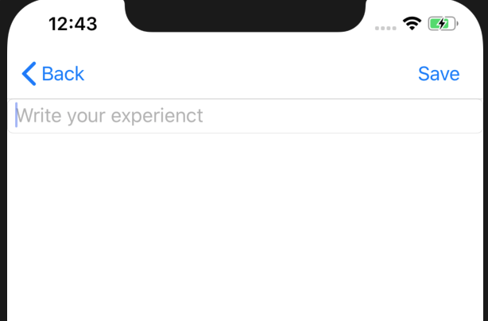

## Read from the Database

- Page.OnAppearing Method
- https://docs.microsoft.com/en-us/dotnet/api/xamarin.forms.page.onappearing?view=xamarin-forms

  ```cs
  namespace TravelRecordApp
  {
      [XamlCompilation(XamlCompilationOptions.Compile)]
      public partial class HistoryPage : ContentPage
      {
          public HistoryPage ()
          {
              InitializeComponent ();
          }

          protected override void OnAppearing()
          {
              base.OnAppearing();

              SQLiteConnection conn = new SQLiteConnection(App.DatabaseLocation);
              conn.CreateTable<Post>(); // This method creates table only if it doesn't exist
              var posts = conn.Table<Post>().ToList();
              conn.Close();

          }
      }
  }
  ```
  - Without closing connection correctly, there will be issue to create another creation of connection to database.

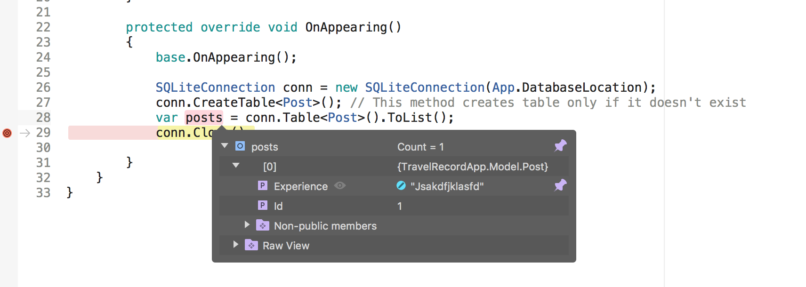

## IDisposable Interface and `using` Statement

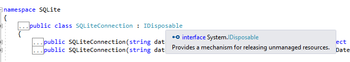
- SQLiteConnection is using IDisposable interface which provides a releasing unmanaged resources.
  - So we write like thie, this will be disposed after the scope, and don't need to `Close()` statement everytime
  ```cs
  protected override void OnAppearing()
  {
      base.OnAppearing();

      using (SQLiteConnection conn = new SQLiteConnection(App.DatabaseLocation))
      {
          conn.CreateTable<Post>(); // This method creates table only if it doesn't exist
          var posts = conn.Table<Post>().ToList();
      }
  }
  ```

## Data Binding
- Connection between objects
- 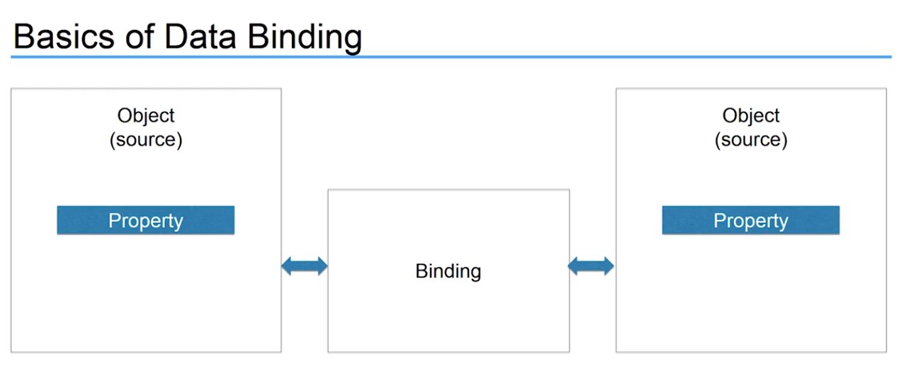
- 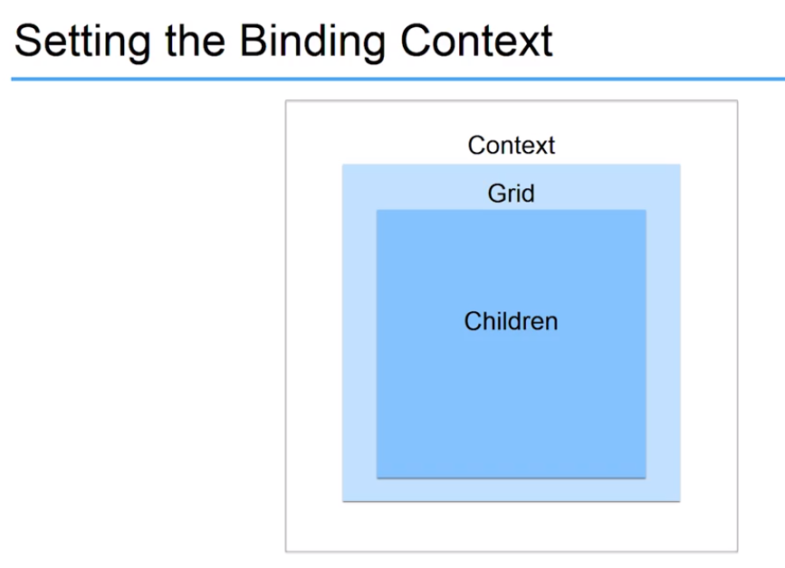
- Binding to a Source
  - Path
  - Mode
    - OneWay
      - target is obtaining from the source 
    - TwoWay
    - OneWayToSource

## ListView
https://docs.microsoft.com/en-us/xamarin/xamarin-forms/app-fundamentals/templates/data-templates/creating
- A common usage scenario for a `DataTemplate` is displaying data from a collection of objects in a `ListView`. The appearance of the data for each cell in the `ListView` can be managed by setting the `ListView.ItemTemplate` property to a DataTemplate.

```xml
<?xml version="1.0" encoding="utf-8" ?>
<ContentPage xmlns="http://xamarin.com/schemas/2014/forms"
             xmlns:x="http://schemas.microsoft.com/winfx/2009/xaml"
             x:Class="TravelRecordApp.HistoryPage">
    <ListView x:Name="postListView">
        <ListView.ItemTemplate>
            <DataTemplate>
                <TextCell Text="{Binding Experience}"/>
            </DataTemplate>
        </ListView.ItemTemplate>
    </ListView>
</ContentPage>
```
```cs
namespace TravelRecordApp
{
	[XamlCompilation(XamlCompilationOptions.Compile)]
	public partial class HistoryPage : ContentPage
	{
		public HistoryPage ()
		{
			InitializeComponent ();
		}

        protected override void OnAppearing()
        {
            base.OnAppearing();

            using (SQLiteConnection conn = new SQLiteConnection(App.DatabaseLocation))
            {
                conn.CreateTable<Post>(); // This method creates table only if it doesn't exist
                var posts = conn.Table<Post>().ToList();
                postListView.ItemsSource = posts;
                conn.Close();
            }
        }
    }
}
```
- `postListView` 로 `ListView`의 이름을 지정한 후, code-behind에서 `postListView.ItemSource`로 `posts` 를 지정.
  - 그 이후, xml form 은 위처럼 작성하면 된다.
  - Binding에서 `Experience`는 `Post` model의 property ! 
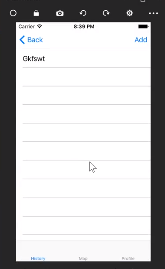

# Maps and Location

## Getting iOS Project ready for Maps
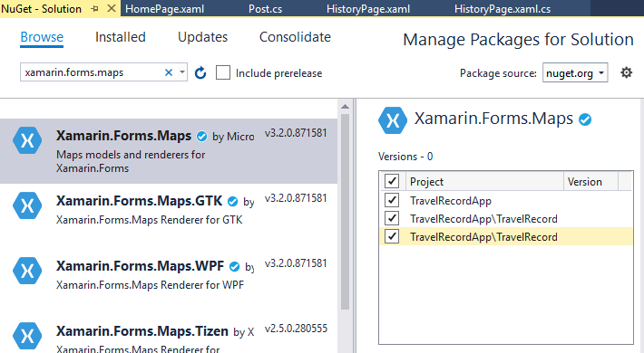

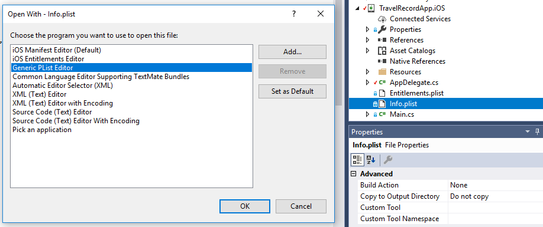
- Info.plist 에서 오른쪽 클릭 후, openwith -> Generic Plist Editor를 클릭
  - 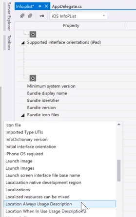
    - Location Always Usage Description
    - Location When In Use Usage Description
      - Almost same but last one will request permission only when the app is openned 
    - 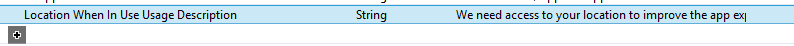
      - Value 값은 permission 요청할때 보여줄 메세지
- 근데 그냥 클릭해서 바로 파일 소스코드를 고쳐도 된다.


## Getting Android Project ready for Maps
```cs
// MainActivity.cs
namespace TravelRecordApp.Droid
{
    public class MainActivity
    {
        protected override void OnCreate(Bundle savedInstanceState)
        {
            TabLayoutResource = Resource.Layout.Tabbar;
            ToolbarResource = Resource.Layout.Toolbar;

            base.OnCreate(savedInstanceState);
            global::Xamarin.Forms.Forms.Init(this, savedInstanceState);

            // Map setting
            Xamarin.FormsMaps.Init(this, savedInstanceState);

            // add db
            string dbName = "travel_db.sqlite";
            string folderPath = System.Environment.GetFolderPath(System.Environment.SpecialFolder.Personal);
            string fullPath = Path.Combine(folderPath, dbName);

            LoadApplication(new App(fullPath));
        }
    }
}
```
- TravelRecordApp.Android 에서 property를 클릭
  - ACCESS_COARSE_LOCATION
  - ACCESS_FINE_LOCATION
  - ACCESS_LOCATION_EXTRA_COMMANDS
  - ACCESS_MOCK_LOCATION
  - ACCESS_NETWORK_STATE
  - ACCESS_WIFI_STATE
  - INTERNET
    - to download map data
- 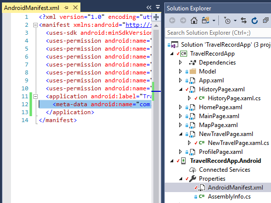
  ```xml
  <meta-data android:name="com.google.android.geo.API_KEY" android:value="HIMIE2JFEUKIDUEISJ213FIEMDKVJSIF1E"/>
  ```
  